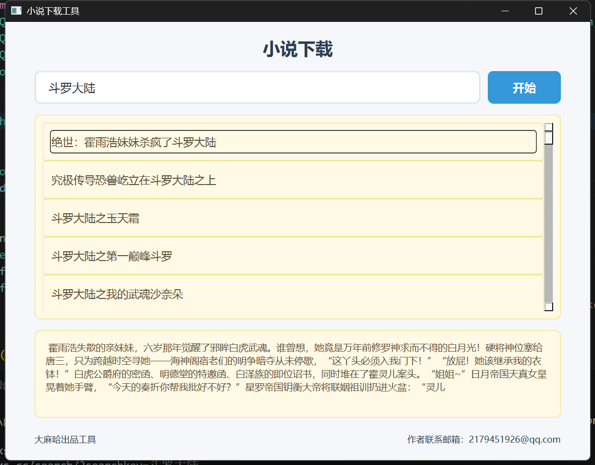
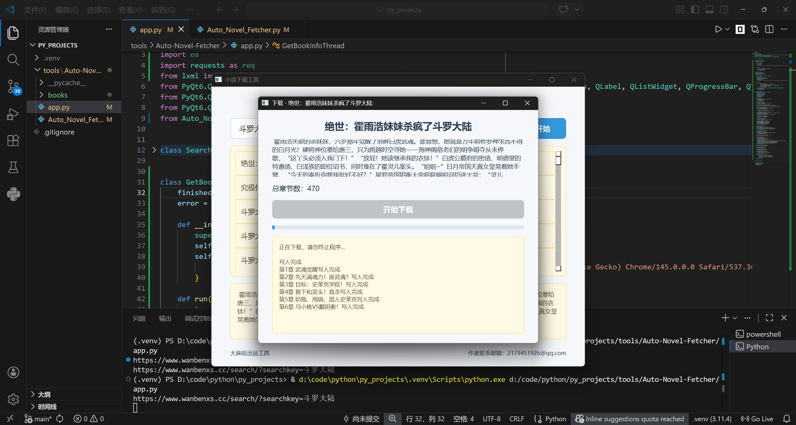
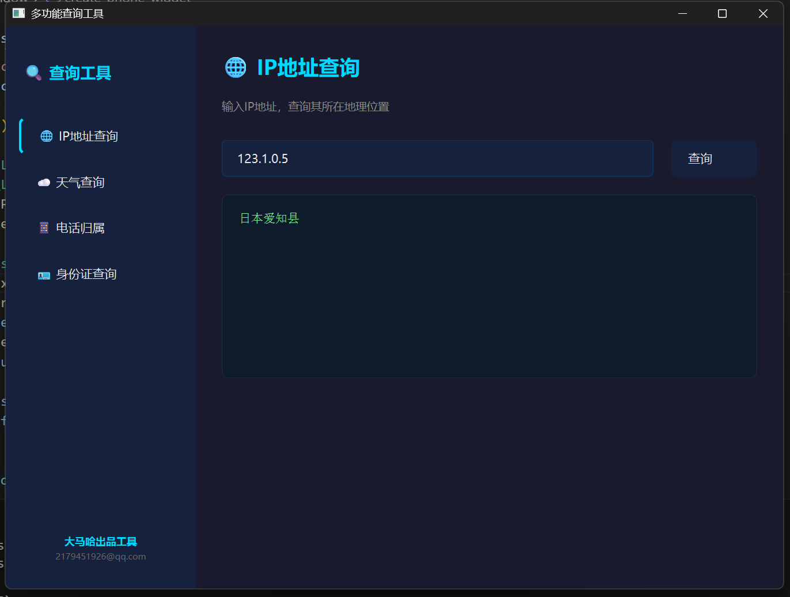
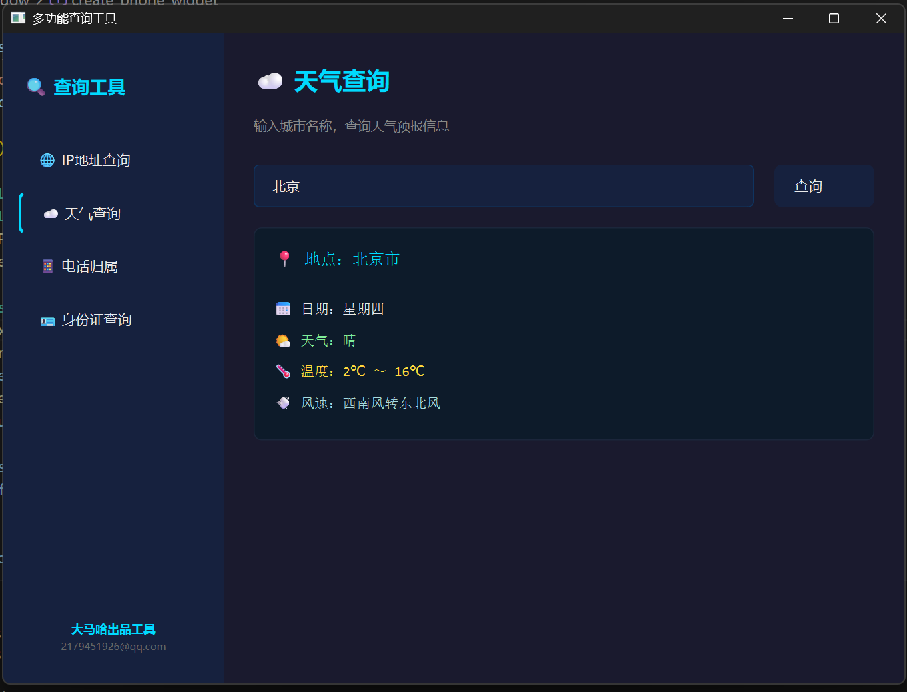
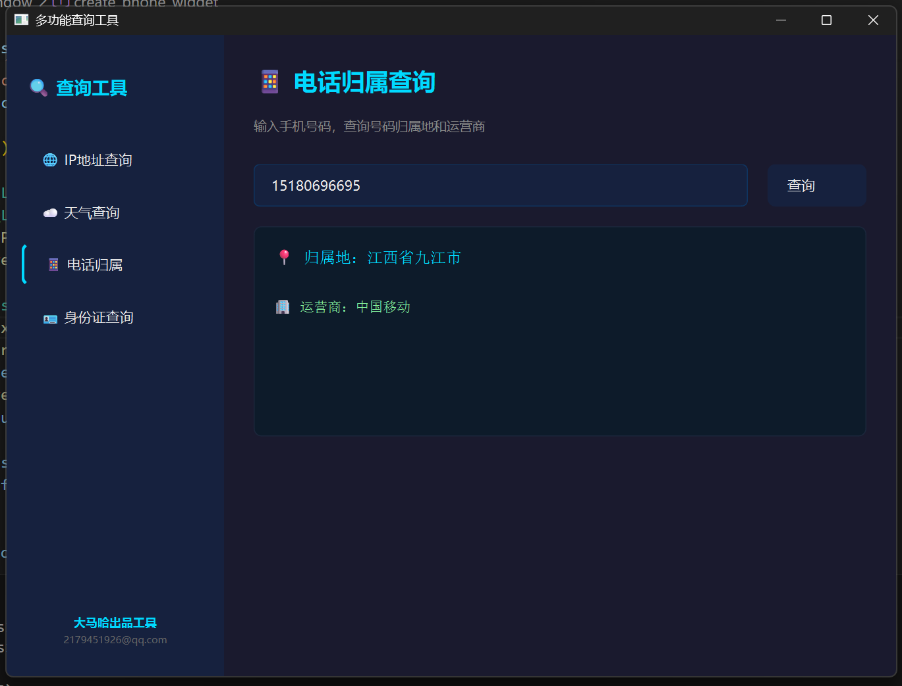
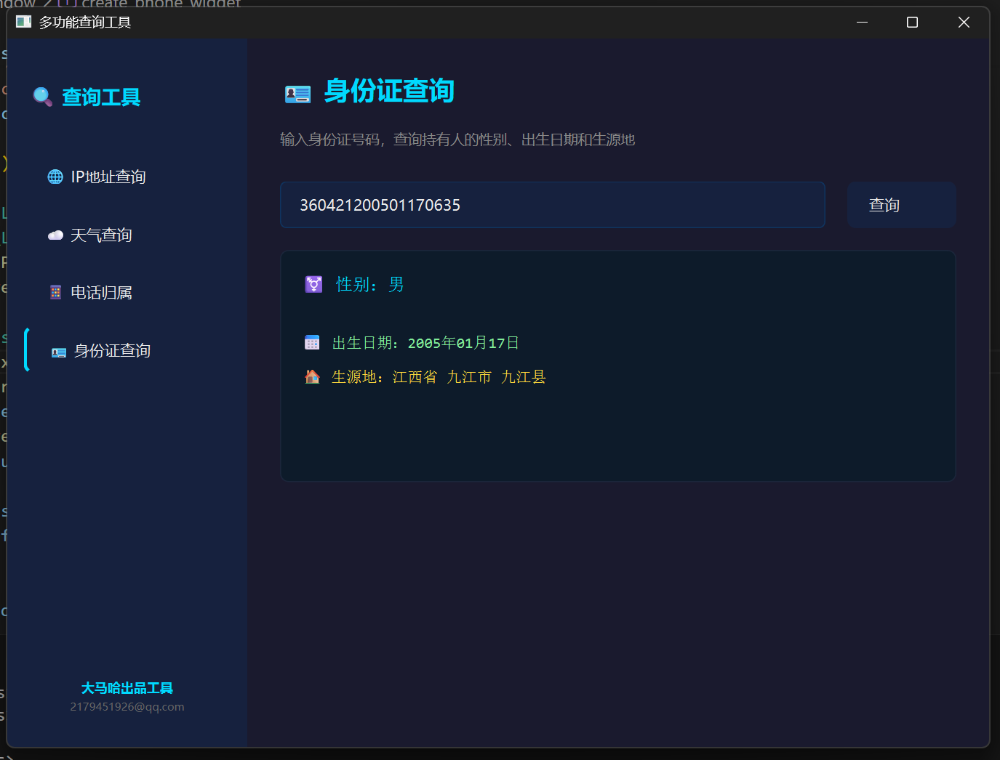
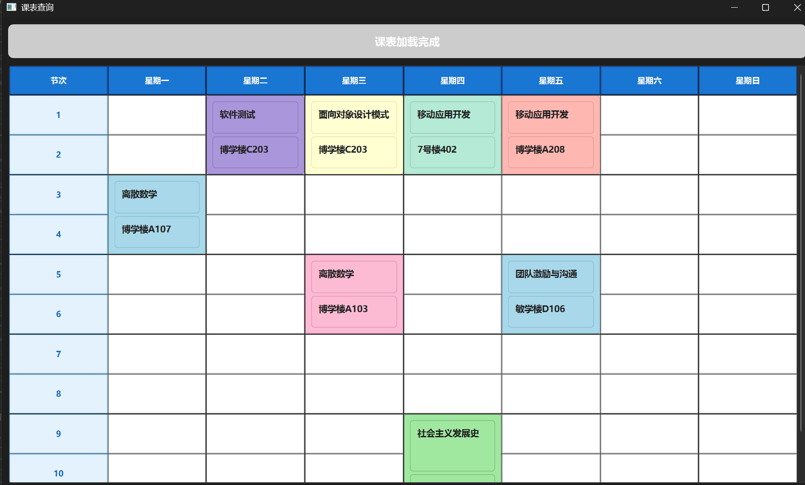
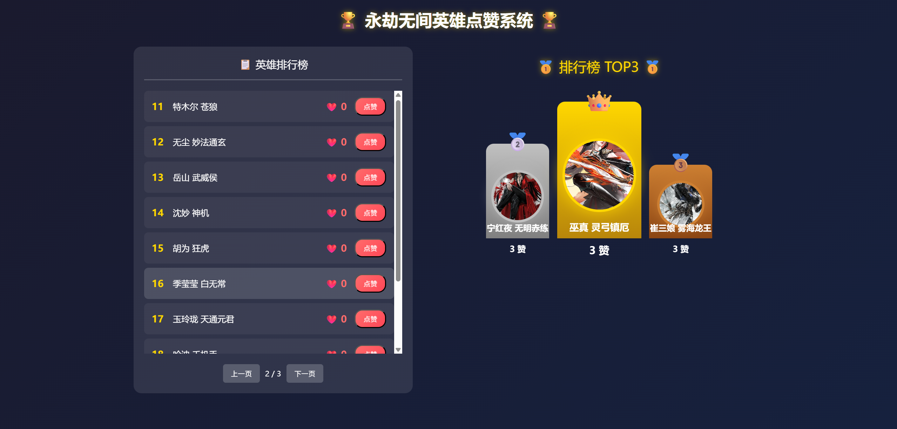
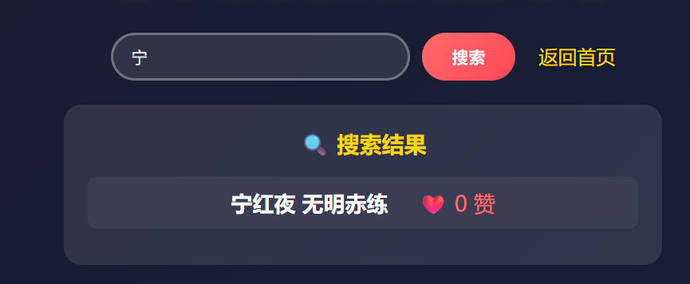

# python项目
- 内部会涉及多个内容的项目
  爬虫自动化工具
web等内容进行学习
```
本内容仅用作学习无其他作用
```
---
## tools
### Auto_Novel_Fetcher
```
本项目基于 Python 爬虫技术开发，实现小说资源的自动化搜索、批量获取与本地下载功能。系统可快速检索并下载海量小说内容至本地，支持离线阅读与自由浏览，有效避免因网络波动、访问限制等不可抗因素导致的阅读中断问题，显著提升阅读体验与数据获取稳定性。
```
- 项目展示

<table>
    <tr>
        <td></td>
        <td></td>
    </tr>
</table>

- 依赖库下载
```python
pip install requests
pip install lxml
pip install PyQt6
pip install pyinstaller
```
#### 项目内容详情
项目主要是基于request，lxml这些技术栈进行
将网站上面的小说的数据进行学习下载浏览，减少去通过网页只能获取单一小说数据的流程能在短时间获取大量数据内容
- 📄 Auto_Novel_Fetcher.py  
- 📄 app.py                 
- 📁 books/                 
  - 📁 书本名1/             
    - 📝 具体章节内容.txt       
  - 📁 书本名2/             
    - 📝 具体章节内容.txt      
```python
app.py内为主要的文件启动页面
Auto_Novel_Fetcher.py 内为细节的逻辑处理部分
books内存储的是书本下载的位置
```
项目完成后进行exe可执行程序的打包pyinstaller
```bash
pyinstaller -F -w tools/Auto-Novel-Fetcher/app.py
```
---
### Search
```
简介：基于python制作的查询小工具，可以对ip地址
身份证号，手机号，天气等信息进行查询
以此内创建的接口可以解决web等其他情况需要调用对应api接口的情况
获取信息，此内接口函数直接调用便可省去调用接口所需要的”大米“
```
- 项目展示
<table>
    <tr>
        <td></td>
        <td></td>
    </tr>
    <tr>
        <td></td>
        <td></td>
    </tr>
</table>

- 依赖库下载
```python
pip install requests
pip install lxml
pip install beautifulsoup4
pip install PyQt6
```
#### 项目内容详情
本项目通过对网上的数据内容进行搜索查询达到类似于api接口的项目功能
实现对应信息的搜索查询，内部还给了一个基于flask的web项目调用过程提供思路去使用对应的功能
同时内部分别使用lxml和beautifulsoup俩种方法获取数据进行对比
- 📄 app.py  
- 📄 desktop.py 
- 📄 web.py                
- 📁 templates/                 
  - 📄 index.html  
```python
app.py内部是实现接口的详细细节
desktop是启动桌面工具的位置
web这里是一个关于调用对应接口的web例子,内部只进行了一个简单项目功能实现
templates内是web调用的超文本存放位置
```
---
### Course-Fetcher
```
简介:本项目是基于在学校日常中要频繁去查询学校官网去查看当天课程引出的自动化爬虫工具
后续思路衍生：可以将此项目放到制作的项目具体实际内容中，例如我自己的个人网站等其他内容形式中。可以定时去运行程序更新课表显示

```
- 项目展示


- 依赖库下载
```bash
pip install selenium
pip install PyQt6
```
#### 项目内容详情
本项目基于 Selenium Web 自动化爬虫框架开发，实现网页表单自动填写、账号自动登录与目标数据智能爬取。项目以通用基础架构为核心，支持快速适配各类网页结构，可广泛应用于重复性网页操作场景。针对校园课表查询需求，系统可自动完成校园官网登录与课表信息获取，替代每日 3-5 次的人工重复操作，显著简化操作流程，提升使用效率。
- 📄 app.py  
- 📄 main.py 
- 📄 config.json（未上传）
```
app.py内是窗口启动的内容函数
main.py内是自动输入表单登录官网获取数据的逻辑
config.json内存取的是我登录官网的账户以及密码信息
在app.py内容下启动程序或者通过将内容打包使用-》pyinstaller（打包库）
```

---
## Web
### Lotery
```
简介：基于flask的简单抽奖web接口
```
- 项目展示

- 
- 依赖库下载
```python
pip install requests
pip install lxml
pip install flask
```
#### 项目内容详情
本项目主页是就flask的web框架制作的一个简易路由抽奖画面
，内部动态数据由王者荣耀官网的动态获取
- 📄 app.py  
- 📄 hero.py                 
- 📁 templates/                 
  - 📄 index.html              
```python
本项目主要路由启动在app.py内进行
hero.py为网页数据的读取
templates内为超文本内容存放的位置
启动项目后浏览器访问http://127.0.0.1:5000/index进入页面内容便可体验此抽奖系统内容
```
---
### Like
```
简介：基于flask的简单点赞web接口
```
- 项目展示


- 依赖库下载
```python
pip install flask
```
#### 项目内容详情
内部的数据根据王者荣耀官网的动态获取，我直接写入数据了，建议对内容进行爬取
数据内容动态存储在data.json文件内
内包含主路由接口，搜索框接口以及点赞部分的接口
- 📄 app.py                 
- 📁 templates/                 
  - 📄 index.html    
- 📄 data.json           
```python
本项目主要路由启动在app.py内进行
templates内为超文本内容存放的位置
data.json内存储的是角色的数据
启动项目后浏览器访问http://127.0.0.1:5000/index进入页面内容便可体验此点赞系统内容
```